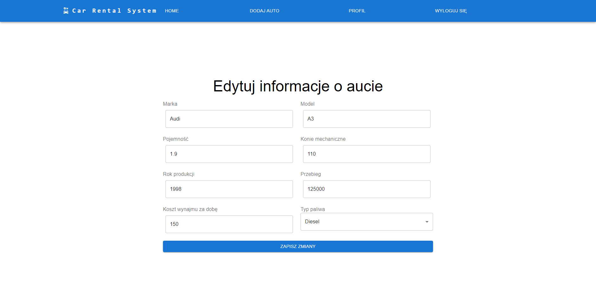
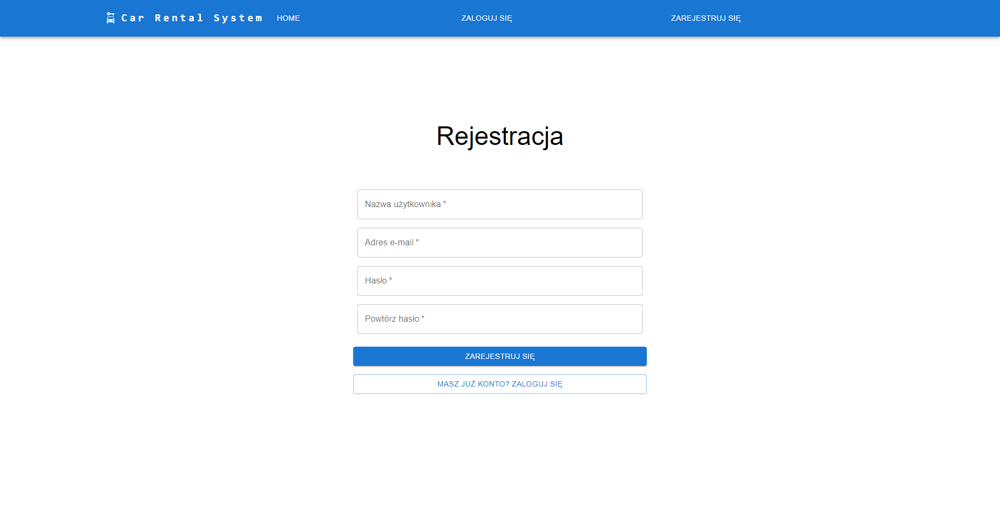

# Car rental system [Frontend]
Repozytorium w ciągłym rozwoju - wczesny etap tworzenia
Frontend do projektu: [car-rental-system-spring](https://github.com/Mr-Victor16/car-rental-system-spring)

## Obecnie zaimplementowane funkcjonalności:
- Zwracanie wszystkich dostępnych do wynajęcia aut

- Logowanie, rejestracja, prosty podgląd profilu, wylogowywanie
